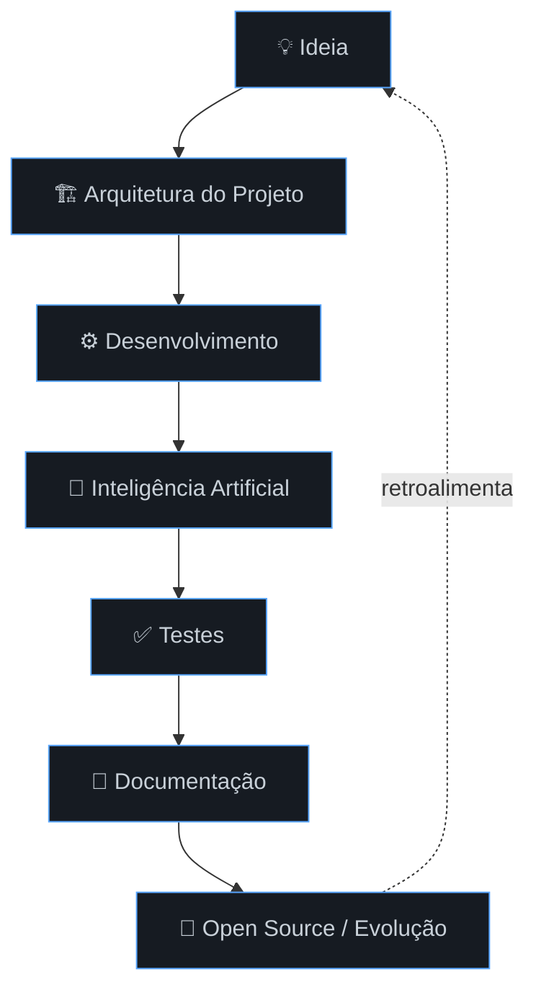
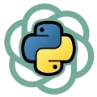
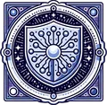
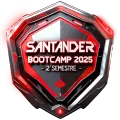
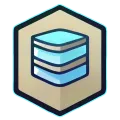
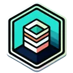
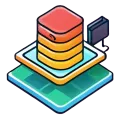
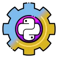

 

  

  

 

Cursando Ciência da Computação, tenho como stack principal Python. Gosto de explorar todo o poder da tecnologia, caminhando por várias áreas: Dados, Software, CyberSecurity, Nuvem. Neste repositório você vai encontrar ideias que foram transformadas em código. Aos poucos estou atualizando os repositórios e organizando as ideias. Prazer em recebê-lo(a).

 

## 📌 Navegação rápida

<!-- ===================================================================== -->
<!-- Navegação rápida -->
<!-- ===================================================================== -->

  

<table>
  <tr>
    <td align="center">
      
    </td>
    <td align="center">
      
    </td>
    <td align="center">
      
    </td>
    <td align="center">
      
    </td>
  </tr>
</table>

## 🚀 Projetos em destaque

<b>🚧 Seção em atualização — clique para expandir</b>

 

<table>
  <tr>
    <td align="center">
      <a href="https://github.com/marco-dev-pinheiro/Cerberus">
        <b>Cerberus</b> 
        
      </a>
    </td>
    <td align="center">
      <a href="#link-projeto-2">
        <b>Em breve atualização</b> 
        
      </a>
    </td>
  </tr>
</table>

<a href="#top">⬆ voltar ao topo</a>

---

## 🧠 Como eu gosto de construir software

<a href="#top">⬆ voltar ao topo</a>

---

## 🛠 stack

<a href="#top">⬆ voltar ao topo</a>

---

## 📈 Roadmap de progresso
### 📊 Nível de Habilidade

<table>
  <tr>
    <td width="150">🐍 <b>Python</b> (53%)</td>
    <td width="400"></td>
  </tr>
  <tr>
    <td>🧠 <b>LLMs</b> (65%)</td>
    <td></td>
  </tr>
  <tr>
    <td>🗄️ <b>SQL</b> (50%)</td>
    <td></td>
  </tr>
  <tr>
    <td>🤖 <b>Machine Learning</b> (40%)</td>
    <td></td>
  </tr>
  <tr>
    <td>🔧 <b>Git</b> (35%)</td>
    <td></td>
  </tr>
  <tr>
    <td>🌱 <b>Open Source</b> (35%)</td>
    <td></td>
  </tr>
  <tr>
    <td>☁️ <b>Cloud</b> (20%)</td>
    <td></td>
  </tr>
</table>  

<a href="#top">⬆ voltar ao topo</a>

---

<b>🏆seção conquistas  clique para expandir</b>

## Minhas conquistas 

  

 
  

---

## 🌎 O que estou estudando

- 🧠 Large Language Models
- 🛡 Secure Coding
- ☁ AWS
- ⚙ Arquitetura de Software
- 📊 Data Engineering
- 🐍 Python Avançado

<a href="#top">⬆ voltar ao topo</a>

---

---

## ❤️ Comunidade — próximos objetivos

- [ ] Contribuir no Serenata de Amor
- [ ] Publicar artigos técnicos com dados politicos
- [ ] Criar biblioteca Python
- [ ] Participar de Hackathons
- [ ] Atuar no mercado de tecnologia.

<a href="#top">⬆ voltar ao topo</a>

---

## 📊 GitHub Stats

<a href="#top">⬆ voltar ao topo</a>

---

## 📬 Contato

