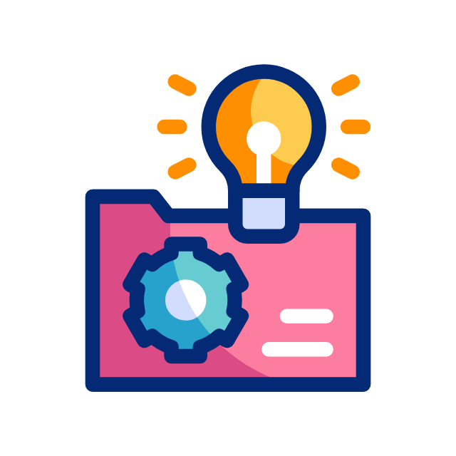
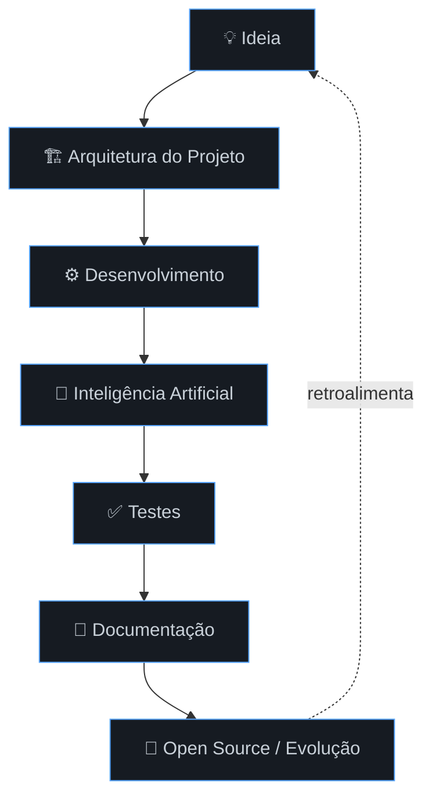

<a name="top"></a>

<div align="center">


<br>


<a href="https://SEU-PORTFOLIO.com">
  
</a>
<a href="https://linkedin.com/in/marco-pinheiro-34256b373">
  
</a>
<a href="mailto:marco.dev.pinheiro@gmail.com">
  
</a>

<br><br>

<!-- 🔧 EDITAR: substitua SEU_USUARIO pelo seu usuário do GitHub -->


</div>

<br>

<div align="center">

Cursando Ciência da Computação tenho como stack principal Python, gosto de explorar todo poder da tecnologia caminho por varias areas Dados, Software´s, CyberSecurity, Nuvem, neste  repositorio voce vai encontrar ideias que foram transformada em codigo.  Aos poucos estou atualizando os repositorios e organizando as ideias. Prazer em recebe-lo(a).  
</div>

<br>

## 📌 Navegação rápida

<<!-- ===================================================================== -->
<!-- Navegação rapida -->
<!-- ===================================================================== -->

<div align="center">


<br>

<table>
<tr>

<td align="center">
  <a href="https://github.com/marco-dev-pinheiro?tab=repositories" target="_blank">
    <br>
    <b>Projetos</b>
  </a>
</td>


<td align="center">
  <a href="https://github.com" target="_blank">
    <br>
    <b>Stack</b>
  </a>
</td>

<td align="center">
  <a href="https://github.com" target="_blank">
    <br>
    <b>RoadMap</b>
  </a>
</td>

<td align="center">
  <a href="https://github.com" target="_blank">
    <br>
    <b>Contato</b>
  </a>
</td>

</tr>
</table>

</div>

---

<a name="projetos"></a>
## 🚀 Projetos em destaque

<details open>
<summary><b>🚧 Seção em atualização — clique para expandir</b></summary>
<br>

> Estou reorganizando esta seção para exibir cards reais dos projetos.
> Sugestão de formato para quando os projetos entrarem (gera um card automático a partir do repositório):

```
<!-- 🔧 EDITAR: TROCAR SEU_USUARIO e NOME_DO_REPO -->
[](https://github.com/SEU_USUARIO/NOME_DO_REPO)
```

 duplicar o bloco acima por projeto, lado a lado, para criar uma "vitrine" de cards.

</details>

<div align="right"><a href="#top">⬆ voltar ao topo</a></div>

---

<a name="metodologia"></a>
## 🧠 Como eu gosto de construir software



<div align="right"><a href="#top">⬆ voltar ao topo</a></div>

---

<a name="stack"></a>
## 🛠 Stack

<div align="center">


</div>

<div align="right"><a href="#top">⬆ voltar ao topo</a></div>

---
# ATUALIZANDO... 🚧
<a name="roadmap"></a>
## 📈 Roadmap

| Tecnologia | Progresso |
|---|---|
| 🐍 Python |  |
| 🔧 Git |  |
| 🗄 SQL |  |
| ☁️ Cloud |  |
| 🤖 Machine Learning |  |
| 🧠 LLMs |  |
| 🌱 Open Source |  |
| 🇺🇸 Inglês |  |

<div align="right"><a href="#top">⬆ voltar ao topo</a></div>

---

<a name="filosofia"></a>
## 🎯 Filosofia

<div align="center">

> ### "Aprender construindo é a forma mais rápida de evoluir."
> — Marco Pinheiro

</div>

<div align="right"><a href="#top">⬆ voltar ao topo</a></div>

---

<a name="estudando"></a>
## 🌎 O que estou estudando

- 🧠 Large Language Models
- 🛡 Secure Coding
- ☁ AWS
- ⚙ Arquitetura de Software
- 📊 Data Engineering
- 🐍 Python Avançado

<div align="right"><a href="#top">⬆ voltar ao topo</a></div>

---

<a name="comunidade"></a>
## ❤️ Comunidade — próximos objetivos

- [ ] Contribuir no Serenata de Amor
- [ ] Publicar artigos técnicos
- [ ] Criar biblioteca Python
- [ ] Participar de Hackathons
- [ ] Mentorar iniciantes

<div align="right"><a href="#top">⬆ voltar ao topo</a></div>

---

<a name="stats"></a>
## 📊 GitHub Stats

<!-- 🔧 EDITAR: troque SEU_USUARIO nas 4 imagens abaixo -->
<div align="center">


<br>


</div>

> 💡 **Snake de contribuições (opcional):** para animar seu gráfico de contribuições, use a action [`platane/snk`](https://github.com/Platane/snk) — ela gera uma imagem SVG animada via GitHub Actions que pode ser embutida aqui.

<div align="right"><a href="#top">⬆ voltar ao topo</a></div>

---

<a name="contato"></a>
## 📬 Contato

<div align="center">

<!-- 🔧 EDITAR: mesmos links do topo -->
<a href="https://SEU-PORTFOLIO.com">
  
</a>
<a href="https://linkedin.com/in/SEU-USUARIO">
  
</a>
<a href="mailto:seu@email.com">
  
</a>

</div>


